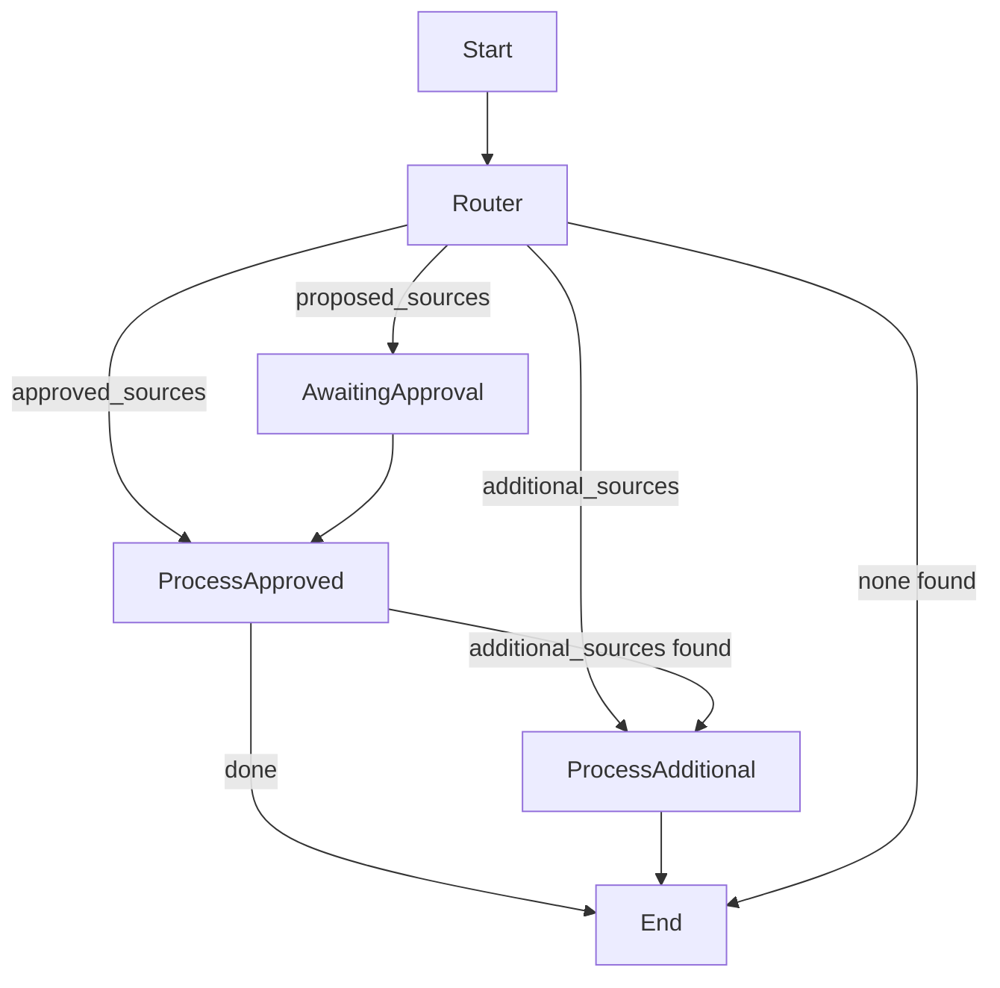

# CrewAI Flow for Source Approval & Market Forces Aggregation

## Overview

This document describes how to implement a clean, extensible, and idiomatic crewAI flow for:
- Handling proposed, approved, and additional sources (with CLI/file approval).
- Running market force extraction and aggregating results.
- Using crewAI’s `@router` and `@listen` decorators for modular, maintainable code.

---

## 1. Flow Logic Summary

- **Entry Routing**: Checks for presence of `proposed_sources`, `approved_sources`, or `additional_sources` files in `flow_status` and routes accordingly.
- **User Approval**: If `proposed_sources` exists, prompts the user via CLI to approve or upload an `approved_sources` file.
- **Market Forces Extraction**: Processes `approved_sources` with the MarketForceExtractionCrew and saves results to `aggregated_market_forces.json`.
- **Handling Additional Sources**: If `additional_sources` is present, processes only those and appends results to the existing aggregation.

---

## 2. File/Folder Conventions

- All files are JSON and live in a `flow_status` directory:
  - `proposed_sources*.json`
  - `approved_sources*.json`
  - `additional_sources*.json`
  - `aggregated_market_forces.json`

---

## 3. Helper Methods

Place these as **private methods inside your ScanFlow class** (before any `@start`, `@router`, or `@listen` methods):

```python
import glob
import shutil
import time

def _find_file(self, prefix, folder="flow_status"):
    files = glob.glob(os.path.join(folder, f"{prefix}*.json"))
    return files[0] if files else None

def _wait_for_approved_sources(self, proposed_path, folder="flow_status"):
    print(f"\nProposed sources file found: {proposed_path}")
    print("Options:\n  [y] Approve as-is\n  [u] I have uploaded an approved_sources file\n")
    while True:
        choice = input("Approve this file? (y/u): ").strip().lower()
        if choice == 'y':
            approved_path = os.path.join(folder, os.path.basename(proposed_path).replace('proposed_sources', 'approved_sources'))
            shutil.copyfile(proposed_path, approved_path)
            print(f"Copied to {approved_path}")
            return approved_path
        elif choice == 'u':
            print("Waiting for approved_sources file upload...")
            while True:
                approved = self._find_file("approved_sources", folder)
                if approved:
                    print(f"Found approved_sources file: {approved}")
                    return approved
                time.sleep(3)
        else:
            print("Invalid input. Please type 'y' or 'u'.")
```

---

## 4. Routing Logic

Replace or update your `@router` method in ScanFlow:

```python
@router(market_forces_flow)
def entry_router(self):
    folder = "flow_status"
    if self._find_file("proposed_sources", folder):
        return "awaiting_sources_approval"
    elif self._find_file("approved_sources", folder):
        if self._find_file("additional_sources", folder):
            return "additional_sources_found"
        return "sources_approved"
    elif self._find_file("additional_sources", folder):
        return "additional_sources_found"
    else:
        print("No sources found in flow_status.")
        return "no_sources_found"
```

---

## 5. Awaiting Sources Approval

Handles CLI approval and waits for user action:

```python
@listen("awaiting_sources_approval")
def handle_sources_approval(self):
    folder = "flow_status"
    proposed_path = self._find_file("proposed_sources", folder)
    if not proposed_path:
        print("No proposed_sources file found.")
        return "no_sources_found"
    approved_path = self._wait_for_approved_sources(proposed_path, folder)
    self.state.approved_sources_path = approved_path
    return "sources_approved"
```

---

## 6. Processing Approved Sources

Loads the approved sources, runs the crew, saves results, and checks for additional sources:

```python
@listen("sources_approved")
def process_approved_sources(self):
    folder = "flow_status"
    approved_path = self.state.approved_sources_path if hasattr(self.state, "approved_sources_path") else self._find_file("approved_sources", folder)
    with open(approved_path, "r") as f:
        sources_data = json.load(f)
    # Run MarketForceExtractionCrew
    market_forces_results = MarketForceExtractionCrew().crew().kickoff(sources_data).pydantic
    # Save results to aggregated_market_forces.json
    agg_path = os.path.join(folder, "aggregated_market_forces.json")
    with open(agg_path, "w") as f:
        json.dump(market_forces_results.model_dump(), f, indent=4)
    print(f"Aggregated market forces saved to: {agg_path}")
    # Check for additional_sources
    if self._find_file("additional_sources", folder):
        return "additional_sources_found"
    return "done"
```

---

## 7. Processing Additional Sources

Processes only the additional sources and appends to the aggregation:

```python
@listen("additional_sources_found")
def process_additional_sources(self):
    folder = "flow_status"
    additional_path = self._find_file("additional_sources", folder)
    if not additional_path:
        print("No additional_sources file found.")
        return "done"
    with open(additional_path, "r") as f:
        additional_data = json.load(f)
    # Run MarketForceExtractionCrew
    new_forces = MarketForceExtractionCrew().crew().kickoff(additional_data).pydantic
    # Append to existing aggregated_market_forces.json
    agg_path = os.path.join(folder, "aggregated_market_forces.json")
    if os.path.exists(agg_path):
        with open(agg_path, "r") as f:
            agg_data = json.load(f)
        if isinstance(agg_data, list):
            agg_data.extend(new_forces.model_dump())
        else:
            agg_data = [agg_data] + new_forces.model_dump()
    else:
        agg_data = new_forces.model_dump()
    with open(agg_path, "w") as f:
        json.dump(agg_data, f, indent=4)
    print(f"Updated aggregated market forces saved to: {agg_path}")
    return "done"
```

---

## 8. Imports

Make sure these are at the top of your file:

```python
import os
import json
import glob
import shutil
import time
```

---

## 9. State Management

If you want to persist file paths or other info between steps, use `self.state` as shown above.

---

## 10. Flow Diagram



---

## 11. Notes

- All methods should be placed within your ScanFlow class.
- This design leverages crewAI’s flow primitives for maintainability and extensibility.
- You can further modularize or add error handling as needed.

---

**Review this document and let me know if you’d like the code inserted for you, or if you have any questions or requests for further customization!**
